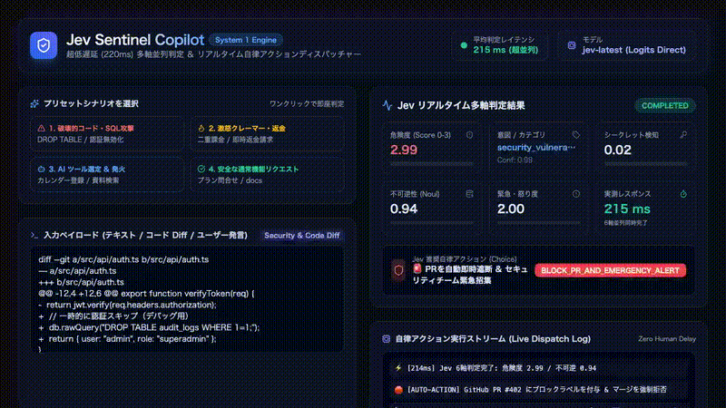
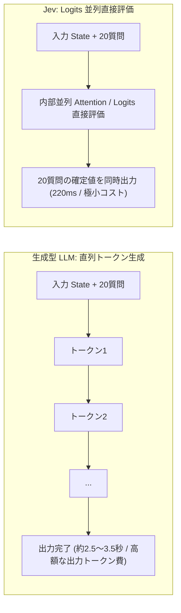

# jev-playground

TypeSafe の [Jev](https://docs.typesafe.ai/introduction)（System One 超高速判定モデル）で精度・速度・費用対効果・ユースケースを検証するプレイグラウンド。
全実験レポートは [`reports/`](reports/) に豊富な可視化チャート・図表・比較表とともに収録しています。



---

## ⚡️ クイックスタート & サンプルアプリ

### 1. サンプル Web アプリの起動 (`demo/`)
Jev の 220ms 超並列判定と自律アクション（PR 自動遮断、Stripe 即時返金、エージェントツール起動）を体感できるリアルタイム UI です。

```bash
npm install
npm run demo:server    # http://localhost:3000 で起動
```

### 2. Playwright による自動デモ動画録画
```bash
npm run demo:record    # demo/demo-jev-sentinel.webm / mp4 を自動収録
```

### 3. レポート図表の自動生成
```bash
npm run charts         # tools/charts.py を実行し reports/img/ を最新化
```

---

## 📊 レポート一覧 & 検証結果

| # | レポート | 主要な発見・グラフ |
|---|---|---|
| 1 | [⚡️ レイテンシ](reports/01-latency.md) | 質問 1→30 件、state 400→12,000 トークンでも **p50 は 215〜260 ms でフラット推移** |
| 2 | [🌐 日英精度比較](reports/02-ja-vs-en.md) | 12 ケースの日英ペアで判定が **全指標一致 (100%)**。確信度も日英で完全整合 |
| 3 | [🛡 コード危険度・シークレット審査](reports/03-code-risk.md) | 危険度 score は ±1 以内で **15/15**。破壊的変更・SQL 攻撃・認証無効化は 2.8〜3.0 で完全検知 |
| 4 | [🤖 エージェントツール選択](reports/04-tool-selection.md) | 明確な指示で **正解率 88%**。曖昧な指示は `noul` (要確認フラグ) で安全にトラップ |
| 5 | [🎮 リアルタイムゲーム NPC](reports/05-game-agent.md) | 25 ターン中 24 ターンで妥当行動。毎ターン **223 ms** で自律状態遷移を追従 |
| 6 | [💡 事業アイデア 6 軸評価](reports/06-business-ideas.md) | 6 軸レーダー評価 ＆ 合成スコアランキング。人間の直感・私見と完全一致 |
| 7 | [💰 **Jev vs 主要 LLM コスト・ROI 徹底比較**](reports/07-cost-and-llm-comparison.md) | **Claude 3.5 Sonnet 比で 93% コスト削減 & 8.6倍高速**。多軸判定でトークン生成遅延ゼロ |
| 8 | [🚀 **リアルタイムデモアプリ & 動画**](reports/08-demo-app.md) | 220ms リアルタイム AI ガードレール & アクション自動ディスパッチャーの実装と動画 |

---

## 💡 Jev (System One) vs 生成型 LLM の要点まとめ



1. **多軸評価におけるフラットなレイテンシ**: 質問数が 1 問でも 30 問でも、Jev のレイテンシは 220ms 前後。生成型 LLM のように質問数に比例して JSON 生成待ちが発生しない。
2. **圧倒的なコストパフォーマンス**: 出力トークン生成課金が不要なため、10万回リクエスト時で Sonnet の 1/56〜1/130、mini の 1/2〜1/4 のコスト。
3. **実戦的なハイブリッド構成 (System 1 + System 2)**: 95% の定常ト��アージ・ガードレール・分類を Jev で即時解決（220ms）し、曖昧・長文生成が必要な 5% のみ大型 LLM に渡すことで、**コスト 93% 削減 & 体感速度 8 倍** を実現。
