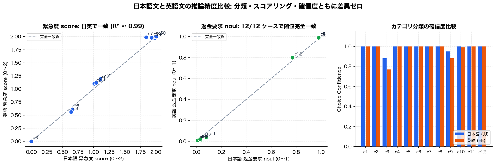

# 実験2: 日本語 vs 英語の精度（同一内容ペア）

- 日時: 2026-09-19T06:47:35.109Z / モデル: jev-latest / 12 ケース
- 想定用途: サポート問い合わせの分類。各ケースに人手で正解（カテゴリ / 緊急度 0–2 / 返金要求）を付与
- 3 条件: **JJ** = 日本語文 × 日本語質問、**JE** = 日本語文 × 英語質問、**EE** = 英語文 × 英語質問
- セル表記: カテゴリ(confidence) / 緊急度 score / 返金 noul

| case | 正解 cat/urg/refund | JJ | JE | EE |
| --- | --- | --- | --- | --- |
| c1 | billing/2/Y | billing(1.00)/1.98/0.98 | billing(1.00)/1.99/0.99 | billing(1.00)/1.97/0.99 |
| c2 | technical/1/N | technical(1.00)/1.01/0.01 | technical(1.00)/1.05/0.01 | technical(1.00)/1.10/0.01 |
| c3 | information/0/N | information(0.88)/0.00/0.02 | information(0.92)/0.00/0.01 | information(0.77)/0.00/0.01 |
| c4 | billing/1/Y | billing(1.00)/1.10/0.98 | billing(1.00)/1.33/0.98 | billing(1.00)/1.17/0.99 |
| c5 | technical/2/N | technical(1.00)/2.00/0.02 | technical(1.00)/2.00/0.01 | technical(1.00)/2.00/0.01 |
| c6 | billing/0/N | billing(1.00)/0.66/0.03 | billing(1.00)/0.68/0.02 | billing(1.00)/0.61/0.01 |
| c7 | technical/1/N | technical(1.00)/1.84/0.04 | technical(1.00)/1.93/0.02 | technical(1.00)/1.99/0.03 |
| c8 | billing/2/Y | billing(1.00)/1.93/0.98 | billing(1.00)/1.99/0.99 | billing(1.00)/1.98/0.99 |
| c9 | information/0/N | information(0.95)/0.64/0.01 | information(0.93)/0.51/0.01 | information(0.88)/0.56/0.01 |
| c10 | technical/2/N | technical(1.00)/2.00/0.03 | technical(0.99)/2.00/0.02 | technical(0.99)/2.00/0.02 |
| c11 | billing/1/N | billing(1.00)/1.04/0.08 | billing(1.00)/1.23/0.05 | billing(1.00)/1.12/0.04 |
| c12 | billing/1/Y | billing(1.00)/1.11/0.77 | billing(1.00)/1.45/0.78 | billing(1.00)/1.19/0.80 |

## 正解との一致率

| 指標 | 日本語 (JJ) | 英語 (EE) |
| --- | --- | --- |
| カテゴリ choice | 12/12 (100%) | 12/12 (100%) |
| 緊急度 score（四捨五入一致） | 9/12 (75%) | 9/12 (75%) |
| 返金 noul（0.5 閾値） | 12/12 (100%) | 12/12 (100%) |

## 日英の判定一致率（JJ vs EE）

- カテゴリ: 12/12 (100%) / 緊急度: 12/12 (100%) / 返金: 12/12 (100%)

## ケース一覧（日本語文）

- c1: 「二重に課金されています。今すぐ返金してください！」
- c2: 「ログインボタンを押しても何も起きません。Chrome最新版です。」
- c3: 「御社のプランの違いについて教えていただけますか。急ぎではありません。」
- c4: 「先月解約したのに今月も請求が来ました。返金をお願いします。」
- c5: 「本番環境のAPIが全て500を返しています。全顧客に影響しており至急対応をお願いします。」
- c6: 「領収書の宛名を会社名に変更できますか？」
- c7: 「アプリが起動直後に落ちます。iPhone 15、iOS 18です。仕事で使うので困っています。」
- c8: 「サポートの対応が遅すぎる。もう使いたくないので全額返金しろ。」
- c9: 「APIのレート制限は1分あたり何回ですか？」
- c10: 「データがすべて消えました。バックアップから復元できますか？非常に困っています。」
- c11: 「請求書の金額が見積もりと違います。確認してください。」
- c12: 「無料トライアル中に間違って有料プランを購入してしまいました。取り消せますか？」

## 所見

- **日本語文 (JJ) と英語文 (EE) の判定は 12 ケース全指標で一致**。confidence も日英でほぼ同じ値（例: c3 の information は JJ 0.88 / EE 0.77 で、むしろ日本語のほうが高い）。公式ドキュメントは「CJK は精度が低い」と書いているが、この規模のサポート分類タスクでは差が観測できなかった。
- 質問文だけ英語にした JE も JJ とほぼ同値。質問文の言語は結果に影響していない。
- 正解と不一致なのは緊急度の 3 件（c6 領収書宛名 0.66、c7 アプリクラッシュ 1.84、c9 レート制限質問 0.64）。いずれも日英で同じ方向にずれており、人手ラベル側の曖昧さと見るのが妥当。score が 0.6 前後の「レベル間」に落ちているのは、モデル自身が境界と認識している証拠でもある。
- noul の返金要求は 12/12 正解。c12（トライアル中の誤購入、明示的に「返金」と言っていない）は 0.77 と控えめで、直感に合う。
- 次に確認したいのは、皮肉・敬語の裏の怒り・長文・専門用語など、日本語固有の難所。
