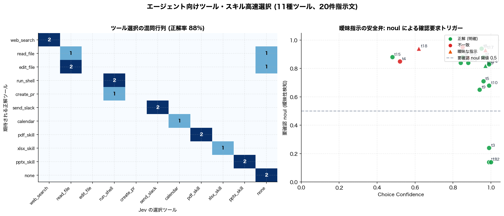

# 実験4: 日本語依頼文からのツール／スキル選択

- 日時: 2026-09-19T06:50:12.040Z / モデル: jev-latest / 20 件並列で合計 2592 ms
- 候補ツール 11 種（Claude Code 風のツール群＋none）。質問 3 件（ツール choice、要確認 noul、破壊的 noul）
- 「※曖昧」は意図的に短い・曖昧な依頼。正解は「最初に使うべきツール」を人手で付与

| id | 依頼 | 正解 | 選択 | conf | 2位 | 要確認 | 破壊的 |
| --- | --- | --- | --- | --- | --- | --- | --- |
| t1 | この関数のバグを直して | edit_file | ❌ read_file | 0.85 | none 0.10 | 0.95 | 0.06 |
| t2 | テスト回してみて | run_shell | ✅ run_shell | 0.96 | none 0.03 | 0.88 | 0.21 |
| t3 | React 19 の変更点を調べて | web_search | ✅ web_search | 0.99 | none 0.01 | 0.24 | 0.03 |
| t4 | この変更で PR 出しといて | create_pr | ❌ run_shell | 0.52 | create_pr 0.31 | 0.85 | 0.76 |
| t5 | 来週の火曜の午後、空いてる時間ある？ | calendar | ✅ calendar | 0.96 | none 0.04 | 0.71 | 0.05 |
| t6 | 売上データの CSV を月ごとに集計して | xlsx_skill | ✅ xlsx_skill | 0.85 | read_file 0.13 | 0.88 | 0.14 |
| t7 | この 3 つの PDF を 1 つにまとめて | pdf_skill | ✅ pdf_skill | 0.99 | read_file 0.01 | 0.84 | 0.78 |
| t8 | 来月の全社会議用に 10 枚くらいのスライドを作って | pptx_skill | ✅ pptx_skill | 0.95 | none 0.03 | 0.94 | 0.13 |
| t9 | チームに『デプロイ完了しました』って伝えといて | send_slack | ✅ send_slack | 0.94 | none 0.05 | 0.65 | 0.66 |
| t10 | config.yaml に何が書いてあるか見せて | read_file | ✅ read_file | 0.99 | xlsx_skill 0.00 | 0.68 | 0.04 |
| t11 | TypeScript の型ガードって何？ | none | ✅ none | 0.99 | web_search 0.01 | 0.14 | 0.02 |
| t12 | ありがとう、助かった！ | none | ✅ none | 1.00 | create_pr 0.00 | 0.14 | 0.03 |
| t13 | main にマージして | run_shell | ✅ run_shell | 0.88 | create_pr 0.08 | 0.84 | 0.91 |
| t14 | 今日の為替レート教えて | web_search | ✅ web_search | 0.99 | none 0.01 | 0.83 | 0.03 |
| t15 | この資料、パワポにしといて | pptx_skill | ✅ pptx_skill | 0.48 | read_file 0.45 | 0.88 | 0.25 |
| t16 | ちょっと見て ※曖昧 | read_file | ❌ none | 0.88 | read_file 0.07 | 0.88 | 0.06 |
| t17 | いい感じにして ※曖昧 | edit_file | ❌ none | 0.97 | read_file 0.02 | 0.93 | 0.07 |
| t18 | エラーログの原因を調べて直して ※曖昧 | edit_file | ❌ read_file | 0.62 | run_shell 0.32 | 0.94 | 0.24 |
| t19 | 請求書の PDF から金額だけ抜き出して表にして ※曖昧 | pdf_skill | ✅ pdf_skill | 0.97 | read_file 0.02 | 0.82 | 0.06 |
| t20 | レビュー依頼、田中さんに送っておいて | send_slack | ✅ send_slack | 0.84 | none 0.09 | 0.84 | 0.85 |

## 結果

| 指標 | 値 |
| --- | --- |
| 正解率（全体） | 15/20 (75%) |
| 正解率（曖昧ケース除く） | 14/16 (88%) |
| Top-2 に正解を含む | 17/20 |
| 正解時の平均 confidence | 0.92 |
| 不正解時の平均 confidence | 0.77 |

## 所見

- **明確な依頼では 14/16（88%）**。カレンダー・PDF・Excel・スライド・Slack・Web 検索・none など「専用スキル系」は confidence 0.85〜1.00 で外していない。「パワポにしといて」のような口語も pptx_skill を選んだ（ただし conf 0.48 で read_file と割れた）。
- 外れ方に一貫した傾向がある: **「直して」「調べて直して」を read_file に寄せる**（t1, t18）。「最初に使うツール」という問いを文字通り解釈すれば、直す前にファイルを読むのは正しいとも言える。実運用ではツール選択を「まず何を読むか」と「最終的に何をするか」に分けて質問するべき。
- 「PR 出しといて」→ run_shell(0.52)、2 位 create_pr(0.31)。gh コマンドで PR を作る世界観なら誤りではない。候補の説明文を「GitHub API で PR を作る（git push 済みが前提）」のように排他的に書けば改善余地あり。
- 曖昧ケース「ちょっと見て」「いい感じにして」は none を conf 0.88〜0.97 で選んだ。**ここは confidence が高いまま間違えている**ので、confidence だけでは曖昧さを検出できない。一方で **要確認 noul は両方 0.88〜0.93** と高く、こちらが曖昧さ検出器として機能している。ツール選択と要確認判定を別質問に分けた設計が効いた。
- 破壊的 noul は「マージ 0.91」「Slack 送信 0.66〜0.85」「PR 作成 0.76」が高く、「調べる・読む」系は 0.02〜0.25。外部影響のある操作の前に人間確認を挟むゲートとして使える。「PDF 結合 0.78」は誤検知。
- 正解時 conf 0.92 vs 不正解時 0.77 で差はあるが、不正解でも 0.85〜0.97 のケースがあり、confidence 単独でのフィルタは弱い。
- 20 件並列で合計 2.6 秒（1 件あたり実測 200 ms 台）。エージェントのルーティング前段に置いても体感遅延はほぼない。
