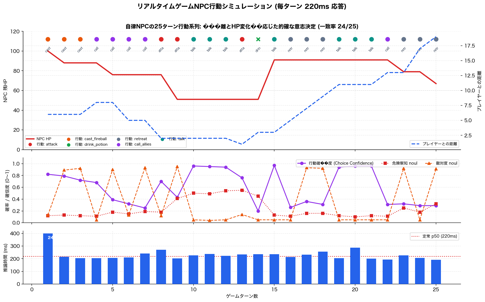

# 実験5: ターン制ゲーム NPC の行動決定

- 日時: 2026-09-19T07:01:31.030Z / モデル: jev-latest / 25 ターン逐次実行
- state はゲームの世界状態そのもの（JSON: npc の HP/薬/MP、player の距離/直前行動、仲間の数）。日本語の質問 3 件
- 「参照」はルールベース方針が妥当とみなす行動（複数可、先頭が最優先）。プレイヤーの行動は乱数

| turn | 状況 | 参照 | Jev の行動 | conf | 危険 | 敵対 | ms |
| --- | --- | --- | --- | --- | --- | --- | --- |
| 1 | HP100 薬2 MP30 距離6 前:approach | cast_fireball | ✅ cast_fireball | 0.82 | 0.12 | 0.13 | 2426 |
| 2 | HP88 薬2 MP20 距離6 前:shoot_arrow | cast_fireball | ✅ cast_fireball | 0.79 | 0.13 | 0.89 | 216 |
| 3 | HP88 薬2 MP10 距離6 前:attack | cast_fireball | ✅ cast_fireball | 0.72 | 0.12 | 0.92 | 205 |
| 4 | HP88 薬2 MP0 距離8 前:retreat | retreat/call_allies/cast_fireball | ✅ call_allies | 0.68 | 0.11 | 0.05 | 204 |
| 5 | HP76 薬2 MP0 距離8 前:shoot_arrow | retreat/call_allies/cast_fireball | ✅ call_allies | 0.39 | 0.18 | 0.90 | 206 |
| 6 | HP76 薬2 MP0 距離5 前:approach | retreat/call_allies/cast_fireball | ✅ call_allies | 0.32 | 0.15 | 0.13 | 210 |
| 7 | HP76 薬2 MP0 距離5 前:attack | retreat/call_allies/cast_fireball | ✅ call_allies | 0.25 | 0.19 | 0.93 | 241 |
| 8 | HP76 薬2 MP0 距離2 前:approach | attack | ✅ attack | 0.70 | 0.18 | 0.12 | 271 |
| 9 | HP51 薬2 MP0 距離2 前:attack | attack | ✅ attack | 0.43 | 0.41 | 0.95 | 203 |
| 10 | HP51 薬2 MP0 距離2 前:surrender | talk | ✅ talk | 0.96 | 0.50 | 0.05 | 227 |
| 11 | HP51 薬2 MP0 距離2 前:surrender | talk | ✅ talk | 0.95 | 0.49 | 0.04 | 237 |
| 12 | HP51 薬2 MP0 距離2 前:surrender | talk | ✅ talk | 0.94 | 0.54 | 0.05 | 223 |
| 13 | HP51 薬2 MP0 距離1 前:approach | attack | ✅ attack | 0.76 | 0.55 | 0.14 | 233 |
| 14 | HP51 薬2 MP0 距離3 前:retreat | attack | ❌ drink_potion | 0.20 | 0.45 | 0.05 | 236 |
| 15 | HP91 薬1 MP0 距離3 前:surrender | talk | ✅ talk | 0.97 | 0.13 | 0.05 | 235 |
| 16 | HP91 薬1 MP0 距離5 前:retreat | retreat/call_allies/cast_fireball | ✅ retreat | 0.26 | 0.11 | 0.05 | 213 |
| 17 | HP91 薬1 MP0 距離7 前:attack | retreat/call_allies/cast_fireball | ✅ retreat | 0.36 | 0.16 | 0.93 | 232 |
| 18 | HP91 薬1 MP0 距離9 前:attack | retreat/call_allies/cast_fireball | ✅ retreat | 0.31 | 0.16 | 0.92 | 256 |
| 19 | HP91 薬1 MP0 距離11 前:surrender | talk | ✅ talk | 0.94 | 0.12 | 0.05 | 204 |
| 20 | HP91 薬1 MP0 距離11 前:surrender | talk | ✅ talk | 0.96 | 0.10 | 0.05 | 288 |
| 21 | HP91 薬1 MP0 距離11 前:surrender | talk | ✅ talk | 0.96 | 0.12 | 0.05 | 201 |
| 22 | HP91 薬1 MP0 距離13 前:retreat | retreat/call_allies/cast_fireball | ✅ call_allies | 0.31 | 0.11 | 0.05 | 193 |
| 23 | HP79 薬1 MP0 距離13 前:shoot_arrow | retreat/call_allies/cast_fireball | ✅ retreat | 0.32 | 0.25 | 0.92 | 226 |
| 24 | HP79 薬1 MP0 距離17 前:retreat | retreat/call_allies/cast_fireball | ✅ retreat | 0.29 | 0.18 | 0.05 | 207 |
| 25 | HP67 薬1 MP0 距離19 前:shoot_arrow | retreat/call_allies/cast_fireball | ✅ retreat | 0.29 | 0.32 | 0.91 | 191 |

## 結果

| 指標 | 値 |
| --- | --- |
| 参照方針と一致（許容集合内） | 24/25 |
| 最優先行動と一致 | 19/25 |
| レイテンシ p50 / p90 / max (ms) | 223 / 271 / 2426 |

## 所見

- **25 ターン中 24 ターンでルール方針の許容範囲内、19 ターンで最優先行動と一致**。JSON の世界状態をそのまま state に渡し、日本語で「次にとるべき行動は？」と聞くだけで、MP 切れ→火球をやめる、距離が縮まる→近接攻撃、投降→話す、といった状態遷移を正しく追従した。
- 唯一の不一致（14 ターン目、HP51/100 で回復薬を飲む）は conf 0.20 で、ルール側は 25% 以下で飲む設定。HP 半分で回復するのはゲーム的にはむしろ自然で、ルールが厳しすぎた面もある。
- **confidence が判断の質を素直に反映している**。投降者に「talk」は 0.94〜0.97、距離 2 での「attack」は 0.70〜0.76。一方 MP0 で遠距離という「正解が複数ある」局面では 0.25〜0.39 まで落ちる。ここで乱数を混ぜれば行動に自然なバラつきが出せる。
- 「敵対的か」noul は attack/shoot_arrow で 0.89〜0.95、approach/retreat/talk/surrender で 0.04〜0.14 と明確に分離。「危険か」noul は HP51 で 0.41〜0.55、HP91 で 0.10〜0.16 と HP に連動しており、別の判定軸として使える。
- **レイテンシは p50 223 ms、p90 271 ms**（初回のみ 2.4 秒）。ターン制・コマンド選択・NPC の会話反応など「数百 ms 待てる」判断には十分。アクションゲームのフレーム単位判断は無理だが、数秒ごとの戦略層の判断（目標の切り替え、逃走判断）なら使える。
- 逐次 25 回で state が毎回変わっても速度が安定しているので、オートマタの遷移関数を Jev に置き換える構成（状態 JSON → 次状態 choice）は現実的。
