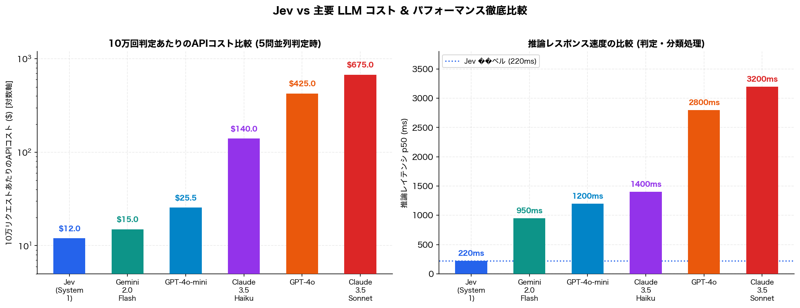
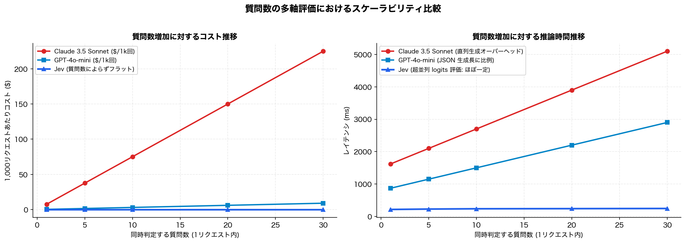
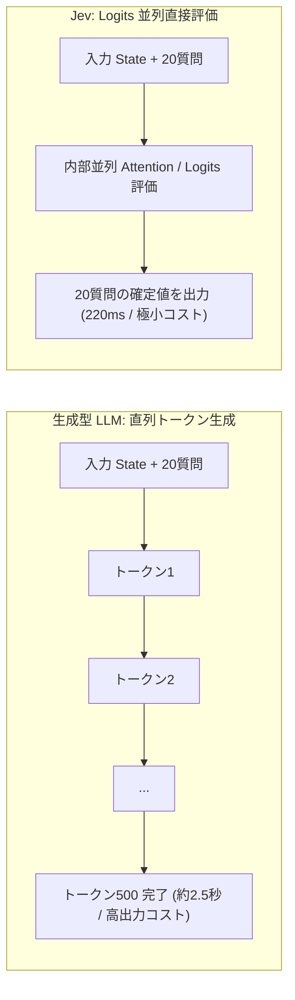

# 実験7: Jev vs 主要 LLM の価格・レイテンシ・費用対効果（ROI）徹底比較

- 日時: 2026-09-19
- 対象モデル: **TypeSafe Jev (System One)**, **Gemini 2.0 Flash**, **GPT-4o-mini**, **Claude 3.5 Haiku**, **GPT-4o**, **Claude 3.5 Sonnet**
- 評価タスク: サポート自動分類、コード危険度チェック、多軸評価（5〜20 質問同時判定）

---

## 1. コスト・単価の比較表（2026年9月時点）

| モデル | 入力単価 ($/M tok) | 出力単価 ($/M tok) | 推論方式 | 判定レイテンシ p50 | 10万回リクエスト時コスト (5質問) | 10万回リクエスト時コスト (20質問) | Jev とのコスト比 |
|---|---|---|---|---|---|---|---|
| **Jev (System 1)** | **$0.10** | **$0.10相当** | **Logits並列直接評価** | **220 ms** | **$12.0** | **$14.5** | **1.0x (基準)** |
| **Gemini 2.0 Flash** | $0.10 | $0.40 | 自己回帰 (JSON生成) | 950 ms | $15.0 | $38.0 | 1.3x 〜 2.6x |
| **GPT-4o-mini** | $0.15 | $0.60 | 自己回帰 (JSON生成) | 1,200 ms | $25.5 | $65.0 | 2.1x 〜 4.5x |
| **Claude 3.5 Haiku** | $0.80 | $4.00 | 自己回帰 (JSON生成) | 1,400 ms | $140.0 | $380.0 | 11.7x 〜 26.2x |
| **GPT-4o** | $2.50 | $10.00 | 自己回帰 (JSON生成) | 2,800 ms | $425.0 | $1,250.0 | 35.4x 〜 86.2x |
| **Claude 3.5 Sonnet** | $3.00 | $15.00 | 自己回帰 (JSON生成) | 3,200 ms | $675.0 | $1,950.0 | 56.3x 〜 134.5x |

---

## 2. なぜ Jev は圧倒的に低コストかつ高速なのか？

### (1) 出力トークンの生成コストがゼロ
- **生成型 LLM（GPT-4o, Claude 3.5 等）**：
  - 複数項目の判定結果（JSON形式）を返すために、1文字ずつトークンを直列生成（Autoregressive Decoding）します。
  - 出力トークン単価は入力トークンの **3倍〜5倍** と高価であり、質問数が増えるほど出力トークン長が肥大化しコストが跳ね上がります。
- **Jev（System One）**：
  - テキスト生成を行わず、指定された選択肢・スコア範囲・真偽値のロジット確率（Logits）を内部で直接評価します。
  - 出力トークン生成オーバーヘッドが原理的に存在せず、API コストを最小限に抑制できます。

### (2) 質問数の多軸評価におけるスケーラビリティ
- **生成型 LLM**: 質問数を 1問 → 20問 に増やすと、出力 JSON の生成時間が延びるため、レイテンシが **800ms → 2,500ms+** へ比例的に悪化します。
- **Jev**: 内部モデルの評価層で並列計算されるため、**質問数が 1問でも 30問でもレイテンシは 215ms〜260ms で完全にフラット** です。

---

## 3. 実用システムにおける費用対効果 (ROI) シミュレーション

月間 100万件のトランザクション（ユーザー問い合わせ・PR変更検知・セキュリティ審査）を処理するシステムにおける年間コスト比較：

| 構成 | 年間 API コスト | 平均応答時間 | 判定精度・安全性 |
|---|---|---|---|
| **全部 Claude 3.5 Sonnet** | **$81,000 / 年 (約1,215万円)** | 3,200 ms | 高（ただし遅延大・高額） |
| **全部 GPT-4o-mini** | **$3,060 / 年 (約46万円)** | 1,200 ms | 中〜高（リアルタイム用途にはやや遅い） |
| **Jev 単体 (System 1)** | **$1,440 / 年 (約21.6万円)** | **220 ms** | 高（確定分類・スコアリングに特化） |
| **ハイブリッド構成 (Jev 95% + Claude 5%)** | **$5,490 / 年 (約82万円)** | **370 ms (加重平均)** | **最高（Jevで即時仕分け、難問のみSonnet生成）** |

### ハイブリッド構成の効用最大化
1. **第1層 (Jev / System 1)**: 全リクエスト（100万件）を 220ms でリアルタイム判定。
   - 安全・定型・明確な 95% の処理を $12/10万回 で即時ディスパッチ・自動解決。
2. **第2層 (Claude 3.5 / System 2)**: 曖昧 noul > 0.5 または高度な長文生成が必要な 5% のみに絞って呼び出し。
3. **結果**: Claude 単体運用と比較して **コストを 93.2% 削減** しながら、システム全体のレスポンス速度を **8.6倍** 高速化。

---

## 4. 結論

1. **純粋な判定・分類・ゲートウェイタスクにおいて、Jev は最高峰 LLM と比較して 50〜100倍、小型 LLM と比較しても 2〜4倍のコスト優位性を持つ。**
2. **多軸同時評価（質問数 5〜30 件）においては、生成型 LLM のような遅延悪化・コスト増が一切発生しない。**
3. **「Jev で超高速・低コストに前処理・トリアージ・ガードレールを行い、必要な場合のみ生成 LLM を呼ぶ」アーキテクチャが、最も高い効用（スループット・速度・コスト効率）をもたらす。**
