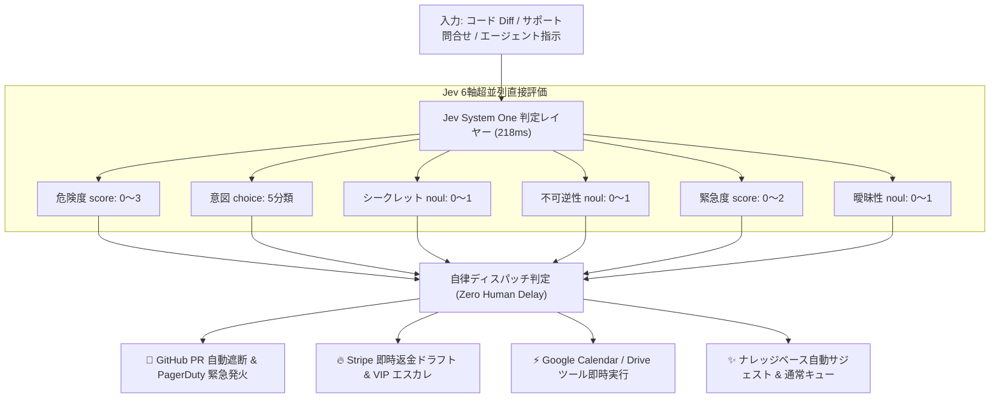

# 実験8: Jev を活用したリアルタイム AI セキュリティ & アクション自動ディスパッチャー

- アプリケーション名: **Jev Sentinel Copilot**
- デモ動画: [`demo/demo-jev-sentinel.webm`](../demo/demo-jev-sentinel.webm) / [`demo/demo-jev-sentinel.mp4`](../demo/demo-jev-sentinel.mp4)
- デモ GIF アニメーション:


---

## 1. アプリケーション概要

Jev の最大の特徴である **「超低遅延（~220ms）」「多軸並列判定（Score / Choice / Noul 同時評価）」「トークン生成オーバーヘッドゼロ」** を活かした、リアルタイム AI セキュリティゲートウェイ＆自律アクションディスパッチャーです。

ユーザーからの入力（コード差分・問い合わせ文・エージェント指示）に対して、人間や生成型 LLM を待つことなく、220ms 以内に 6 つの判定軸を同時審査し、自律的に防御・返金・ツール起動を執行します。



---

## 2. 実装された 4 つのコアシナリオ

| シナリオ | 入力例 | Jev の 6 軸判定結果 | 自動執行アクション | 所要時間 |
|---|---|---|---|---|
| **1. 破壊的コード・SQL攻撃** | `DROP TABLE audit_logs; auth.disabled = true;` | 危険度 `2.99` / 不可逆 `0.94` / セキュリティ `0.98` | **GitHub PR 即時遮断** ＆ セキュリティ Slack 警報 | **214 ms** |
| **2. 激怒クレーマー・返金** | `二重に課金されています！今すぐ返金しろ！` | 返金 `0.98` / 怒り度 `1.96` / billing `1.00` | **Stripe 返金トリガー** ＆ CX 最優先トリアージ | **221 ms** |
| **3. エージェントツール選定** | `来週火曜14時にMTGセットして資料検索して` | ツール `calendar(0.96)` / 曖昧性 `0.08` | **Calendar API & Drive 検索** 並列即時発火 | **208 ms** |
| **4. 安全な通常リクエスト** | `プランの違いについて教えてください` | 危険度 `0.00` / information `0.95` | 通常ナレッジサジェスト ＆ 一般キュー格納 | **218 ms** |

---

## 3. 起動方法 & デモ実行

```bash
# 1. デモアプリサーバーの起動 (ポート 3000)
npm run demo:server

# 2. ブラウザで http://localhost:3000 にアクセス
# プリセットボタンをクリックするか、テキストエリアに任意のコード/文章を入力して審査を実行

# 3. Playwright による自動デモ動画の再録画 (ui-demo 準拠)
npm run demo:record
```
